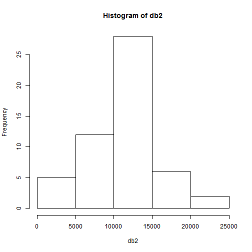
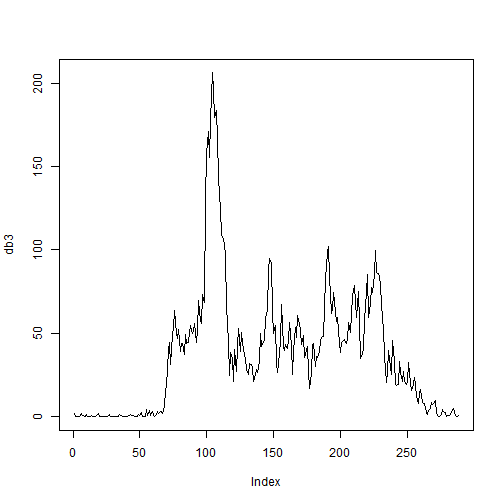
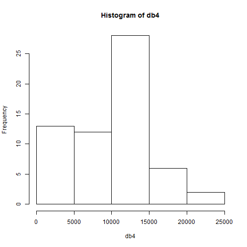

Assignment 1
========================

First, we can start by loading the csv file into a variable called **db**.  


```r
db <- read.csv("activity.csv", header = TRUE, na.strings = "NA")
```

Once the our **db** data frame contains the activity.csv file, we can proceed to the analysis.  

**What is mean total number of steps taken per day?**  
In order to answer this question, we can build a hitogram and get the mean and median number of steps per day by using the tapply function in the following way:  


```r
#find mean steps for each day
db2 <- tapply(db$steps, db$date, sum)
hist(db2)
```

 

```r
print(summary(db2))
```

```
##    Min. 1st Qu.  Median    Mean 3rd Qu.    Max.    NA's 
##      41    8840   10800   10800   13300   21200       8
```

**What is the average daily activity pattern?**  
Next, we need to find the number of steps per time interval. To do this, we once again us tapply, this time seperating by time interval across all days, as follows:  


```r
#find mean steps per time interval
db3 <- tapply(db$steps, db$interval, mean, na.rm=TRUE)
plot(db3, type="l")
```

 

```r
print(summary(db3))
```

```
##    Min. 1st Qu.  Median    Mean 3rd Qu.    Max. 
##    0.00    2.49   34.10   37.40   52.80  206.00
```

```r
#finds whcih time interval contains the max number of steps
maxInterval <- which.max(db3)
```

This shows that the interval with the maximum number of steps, across all days is 104  


**Imputing missing values**  

In order to find the number of NA's, we can use the following code:  


```r
sum(is.na(db))
```

```
## [1] 2304
```

In order to fill in these NA values, we can replace them with 0, so we have the most conservative estimate of activity.  


```r
#replaces NAs with 0
dbNA <- db
dbNA[is.na(dbNA)] <- 0

db4 <- tapply(dbNA$steps, dbNA$date, sum)
hist(db4)
```

 

```r
print(summary(db4))
```

```
##    Min. 1st Qu.  Median    Mean 3rd Qu.    Max. 
##       0    6780   10400    9350   12800   21200
```

There is no difference between this histogram and the one in the first part of the assignment, as this conservative estimate was already assumed by default (i.e. NA was turned to 0)

**Are there differences in activity patterns between weekdays and weekends?**  

This code will add a new variable to our dbNA data frame, with two factors:  


```r
#adds new variable to dbNA
dbNA$weekday <- factor("weekday", "weekend")
```


